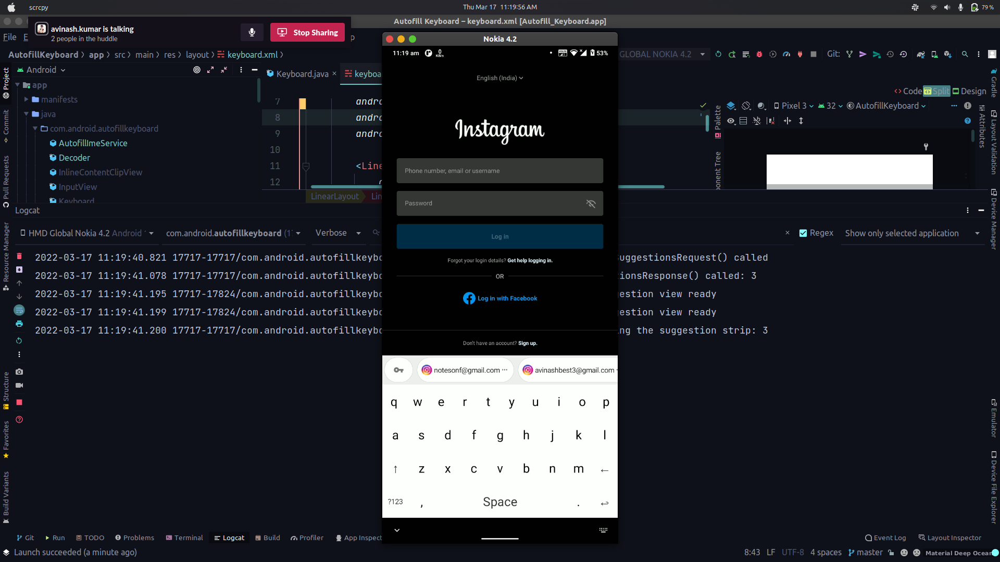

# Autofill Keyboard

- Beginning in Android 11, keyboards and other input-method editors (IMEs) can display autofill suggestions inline, in a suggestion strip or something similar, instead of the system displaying these in a dropdown menu.
- Since these autofill suggestions can contain private data, such as passwords or credit-card information, the suggestions are hidden from the IME until the user selects one.
- IMEs and password managers both need to be updated to make use of this feature. If an IME or a password manager does not support inline autofill, suggestions are shown in a drop-down menu, as they were before Android 11.

# Workflow

To understand how inline autofill works, it's helpful to walk through the process. In this flow, IME means the current keyboard or other input editor, and suggestion provider means the appropriate provider of that autofill suggestion. Depending on the input field and the user's settings, the suggestion provider might be the platform or an autofill service.

- The user focuses on an input field that triggers autofill, like a password or credit-card input field.

- The platform queries the current IME and the appropriate suggestion provider to see if they support inline autofill. If either the IME or the suggestion provider does not support inline autofill, the suggestion is shown in a drop-down menu, as on Android 10 and lower.

- The platform asks the IME to provide a suggestion request. This suggestion request specifies the maximum number of suggestions the IME would like, and also provides presentation specs for each suggestion. The presentation specs specify things like maximum size, text size, colors, and font data, allowing the suggestion provider to match the look and feel of the IME.

- The platform asks the suggestion provider to provide up to the requested number of suggestions. Each suggestion includes a callback to inflate a `View` containing the suggestion's UI.

- The platform informs the IME that suggestions are ready. The IME displays the suggestions by calling the callback method to inflate each suggestion's `View`. To protect the user's private information, the IME does not see what the suggestions are at this stage.

- If the user chooses one of the suggestions, the IME is informed the same way it would have been if the user had chosen a suggestion from a drop-down list.



# Configure IMEs to support inline autofill

This section describes how to configure your IME to support inline autofill. If your IME does not support inline autofill, the platform defaults to showing autofill suggestions in a drop-down menu.

Your IME must set the `supportsInlinedSuggestions` attribute to `true`:

```code
<input-method
    xmlns:android="http://schemas.android.com/apk/res/android"
    android:supportsInlineSuggestions="true"/>
```

When the platform needs an autofill suggestion, it calls your IME's `InputMethodService.onCreateInlineSuggestionsRequest()` method. You must implement this method. Return an `InlineSuggestionsRequest` specifying the following:

- How many suggestions your IME would like

- An `InlinePresentationSpec` for each suggestion, defining how the suggestion should be presented

**Note:** If you provide fewer presentation specs than the number of suggestions requested, the last spec is used for all the excess suggestions. This means, for example, that if you provide only a single presentation spec, the suggestion provider uses that spec for all the suggestions.

When the platform has suggestions, it calls your IME's `onInlineSuggestionsResponse()` method, passing an `InlineSuggestionsResponse` containing the suggestions. You must implement this method. Your implementation calls `InlineSuggestionsResponse.getInlineSuggestions()` to get the list of suggestions, then inflates each suggestion by calling its `InlineSuggestion.inflate()` method.
